# 🚀 GLM-4.7 vs. The $200 Giants: Is China's $3 AI Coding Tool the New Market King?

```text
██████╗ ██╗     ███╗   ███╗      ██╗  ██╗    ███████╗
██╔════╝ ██║     ████╗ ████║      ██║  ██║    ╚════██║
██║  ███╗██║     ██╔████╔██║█████╗███████║        ██╔╝
██║   ██║██║     ██║╚██╔╝██║╚════╝╚════██║       ██╔╝ 
╚██████╔╝███████╗██║ ╚═╝ ██║           ██║       ██║  
 ╚═════╝ ╚══════╝╚═╝     ╚═╝           ╚═╝       ╚═╝  
      THE FRONTIER AGENTIC REASONING MODEL (2025)
```

### 💡 Key Takeaways (TL;DR)
- **GLM-4.7** is the new **SOTA (State of the Art)** AI coding model for 2025.
- Developed by **Zhipu AI**, it offers enterprise-level performance matching or exceeding flagship models like **Claude Sonnet 4.5** and **GPT-5.1 High**.
- **Context Window**: Massive **200K tokens** for full codebase analysis.
- **Best For**: Cost-conscious developers, agentic workflows, and high-complexity debugging.

The global landscape for AI-powered development is shifting. While Western tools like **Cursor Pro** and **GitHub Copilot** have dominated by charging premium subscription rates (often reaching $200 per year), a new contender from Beijing, China, has arrived to dismantle that pricing model.

**Zhipu AI** has released **GLM-4.7**, a large language model specifically engineered for coding, offering performance that rivals top-tier US models. For pricing information, visit [Z.ai subscription page](https://z.ai/subscribe?ic=R0K78RJKNW) or use via [OpenRouter](https://openrouter.ai/).

---

## ⚔️ The Frontier Battle: Verified Benchmarks

GLM-4.7 demonstrates competitive performance against the newest generation of flagship models, including **Claude Sonnet 4.5** and **GPT-5.1 High**, based on the official Z.ai Technical Report (Dec 2025).

### 📊 2025 AI Coding Model Performance Comparison
*Note: Best scores per category are highlighted in $\color{green}{\text{green}}$. Data sourced from [Z.ai Official Blog](https://z.ai/blog/glm-4.7).*

```mermaid
flowchart TD
    subgraph GLM [🚀 GLM-4.7 Dominance]
        direction TB
        MATH[🧮 MATH<br/>AIME 25]
        CODING[💻 CODING<br/>LiveCodeBench v6]
        SCIENCE[🔬 SCIENCE<br/>GPQA-Diamond]
        LOGIC[🧠 LOGIC<br/>HLE w/Tools]
        ENGINEERING[⚙️ ENGINEERING<br/>SWE-bench]
        AGENTIC[🤖 AGENTIC<br/>τ²-Bench]
        
        GLM_MATH[<b>GLM-4.7<br/>95.7%</b>]
        GLM_CODING[<b>GLM-4.7<br/>84.9%</b>]
        GLM_SCIENCE[<b>GLM-4.7<br/>85.7%</b>]
        GLM_LOGIC[<b>GLM-4.7<br/>42.8%</b>]
        GLM_ENG[<b>GLM-4.7<br/>73.8%</b>]
        GLM_AGENT[<b>GLM-4.7<br/>87.4%</b>]
        
        MATH --> GLM_MATH
        CODING --> GLM_CODING
        SCIENCE --> GLM_SCIENCE
        LOGIC --> GLM_LOGIC
        ENGINEERING --> GLM_ENG
        AGENTIC --> GLM_AGENT
    end
    
    subgraph COMPETITORS [📊 Top Competitors]
        direction LR
        
        subgraph GEM [💎 Gemini 3.0 Pro]
            G_MATH[95.0%]
            G_CODING[<b>90.7%</b>]
            G_SCIENCE[<b>91.9%</b>]
            G_LOGIC[<b>45.8%</b>]
            G_ENG[76.2%]
            G_AGENT[<b>90.7%</b>]
        end
        
        subgraph GPT [🔵 GPT-5.1 High]
            P_MATH[94.0%]
            P_CODING[87.0%]
            P_SCIENCE[<b>88.1%</b>]
            P_LOGIC[42.7%]
            P_ENG[76.3%]
            P_AGENT[82.7%]
        end
        
        subgraph DS [🟢 DeepSeek-V3.2]
            D_MATH[93.1%]
            D_CODING[83.3%]
            D_SCIENCE[82.4%]
            D_LOGIC[40.8%]
            D_ENG[73.1%]
            D_AGENT[85.3%]
        end
        
        subgraph CLAUDE [🟣 Claude Sonnet 4.5]
            C_MATH[87.0%]
            C_CODING[64.0%]
            C_SCIENCE[83.4%]
            C_LOGIC[32.0%]
            C_ENG[<b>77.2%</b>]
            C_AGENT[87.2%]
        end
    end
    
    GLM_MATH -.-> G_MATH
    GLM_MATH -.-> P_MATH
    GLM_MATH -.-> D_MATH
    GLM_MATH -.-> C_MATH
    
    GLM_CODING -.-> G_CODING
    GLM_CODING -.-> P_CODING
    GLM_CODING -.-> D_CODING
    GLM_CODING -.-> C_CODING
    
    GLM_SCIENCE -.-> G_SCIENCE
    GLM_SCIENCE -.-> P_SCIENCE
    GLM_SCIENCE -.-> D_SCIENCE
    GLM_SCIENCE -.-> C_SCIENCE
    
    GLM_LOGIC -.-> G_LOGIC
    GLM_LOGIC -.-> P_LOGIC
    GLM_LOGIC -.-> D_LOGIC
    GLM_LOGIC -.-> C_LOGIC
    
    GLM_ENG -.-> G_ENG
    GLM_ENG -.-> P_ENG
    GLM_ENG -.-> D_ENG
    GLM_ENG -.-> C_ENG
    
    GLM_AGENT -.-> G_AGENT
    GLM_AGENT -.-> P_AGENT
    GLM_AGENT -.-> D_AGENT
    GLM_AGENT -.-> C_AGENT
    
    classDef glmNode fill:#00C853,stroke:#004D40,stroke-width:3px,color:#FFFFFF,font-weight:bold,font-size:13px,radius:8px
    classDef geminiNode fill:#FFB74D,stroke:#E65100,stroke-width:2px,color:#FFFFFF,font-weight:bold,font-size:12px,radius:6px
    classDef gptNode fill:#64B5F6,stroke:#1565C0,stroke-width:2px,color:#FFFFFF,font-weight:bold,font-size:12px,radius:6px
    classDef deepseekNode fill:#4DB6AC,stroke:#00695C,stroke-width:2px,color:#FFFFFF,font-weight:bold,font-size:12px,radius:6px
    classDef claudeNode fill:#AB47BC,stroke:#6A1B9A,stroke-width:2px,color:#FFFFFF,font-weight:bold,font-size:12px,radius:6px
    classDef categoryNode fill:#37474F,stroke:#263238,stroke-width:2px,color:#ECEFF1,font-weight:bold,font-size:11px,radius:4px
    classDef subgraphNode fill:#FAFAFA,stroke:#B0BEC5,stroke-width:2px,stroke-dasharray: 5 5
    
    class GLM_MATH,GLM_CODING,GLM_SCIENCE,GLM_LOGIC,GLM_ENG,GLM_AGENT glmNode
    class G_MATH,G_CODING,G_SCIENCE,G_LOGIC,G_ENG,G_AGENT geminiNode
    class P_MATH,P_CODING,P_SCIENCE,P_LOGIC,P_ENG,P_AGENT gptNode
    class D_MATH,D_CODING,D_SCIENCE,D_LOGIC,D_ENG,D_AGENT deepseekNode
    class C_MATH,C_CODING,C_SCIENCE,C_LOGIC,C_ENG,C_AGENT claudeNode
    class MATH,CODING,SCIENCE,LOGIC,ENGINEERING,AGENTIC categoryNode
```



| Category | Benchmark | **GLM-4.7** | Claude Sonnet 4.5 | GPT-5.1 High | DeepSeek-V3.2 | Gemini 3.0 Pro | Source |
| :--- | :--- | :--- | :--- | :--- | :--- | :--- | :--- |
| **Math** | AIME 25 | $\color{green}{\textbf{95.7}}$ | 87.0 | 94.0 | 93.1 | 95.0 | [Z.ai](https://z.ai/blog/glm-4.7) |
| **Coding** | LiveCodeBench v6 | 84.9 | 64.0 | 87.0 | 83.3 | $\color{green}{\textbf{90.7}}$ | [Z.ai](https://z.ai/blog/glm-4.7) |
| **Science** | GPQA-Diamond | 85.7 | 83.4 | 88.1 | 82.4 | $\color{green}{\textbf{91.9}}$ | [Z.ai](https://z.ai/blog/glm-4.7) |
| **Logic** | HLE (w/ Tools) | 42.8 | 32.0 | 42.7 | 40.8 | $\color{green}{\textbf{45.8}}$ | [Z.ai](https://z.ai/blog/glm-4.7) |
| **Engineering**| SWE-bench (Ver.) | 73.8% | $\color{green}{\textbf{77.2%}}$ | 76.3% | 73.1% | 76.2% | [Z.ai](https://z.ai/blog/glm-4.7) |
| **Agentic** | τ²-Bench | 87.4% | 87.2% | 82.7% | 85.3% | $\color{green}{\textbf{90.7%}}$ | [Z.ai](https://z.ai/blog/glm-4.7) |

**📊 Additional Sources:** [HuggingFace Model Card](https://huggingface.co/zai-org/GLM-4.7) | [Ollama Library](https://ollama.com/library/glm-4.7) | [LLM-Stats Analysis](https://llm-stats.com/models/glm-4.7) | [Vertu Comparison](https://vertu.com/lifestyle/glm-4-7-vs-claude-opus-4-5-the-thinking-open-source-challenger/)

---

## 🛠️ What is GLM-4.7? Technical Specifications and Features
GLM-4.7 is the latest iteration of the General Language Model (GLM) series developed by Beijing-based **Zhipu AI**.

### 🚀 Key Technical Highlights (from Z.ai blog)
- **Interleaved Thinking:** GLM-4.7 thinks before every response and tool calling, improving instruction following and quality of generation.
- **Preserved Thinking:** In coding agent scenarios, GLM-4.7 automatically retains all thinking blocks across multi-turn conversations, reusing existing reasoning instead of re-deriving from scratch.
- **Turn-level Thinking:** GLM-4.7 supports per-turn control over reasoning within a session—disable thinking for lightweight requests to reduce latency/cost, enable it for complex tasks to improve accuracy and stability.
- **Tool Using:** GLM-4.7 achieves significant improvements in tool using, with better performances on benchmarks such as τ²-Bench and on web browsing via BrowseComp.

---

## 📈 GLM-4.7 vs GLM-4.6: Key Improvements

Based on [Z.ai Technical Report](https://z.ai/blog/glm-4.7), GLM-4.7 delivers significant gains across core benchmarks compared to its predecessor GLM-4.6:

### � Performance Gains
| Benchmark | GLM-4.6 | GLM-4.7 | Improvement |
| :--- | :--- | :--- | :--- |
| **SWE-bench** | 68.0% | 73.8% | **+5.8%** |
| **SWE-bench Multilingual** | 53.8% | 66.7% | **+12.9%** |
| **Terminal Bench 2.0** | 24.5% | 41.0% | **+16.5%** |
| **HLE (w/ Tools)** | 30.4% | 42.8% | **+12.4%** |
| **LiveCodeBench-v6** | 82.8% | 84.9% | **+2.1%** |

### �️ Enhanced Capabilities
- **Interleaved Thinking:** GLM-4.7 thinks before every response and tool calling, improving instruction following and quality of generation.
- **Preserved Thinking:** In coding agent scenarios, GLM-4.7 automatically retains all thinking blocks across multi-turn conversations, reusing existing reasoning instead of re-deriving from scratch.
- **Turn-level Thinking:** GLM-4.7 supports per-turn control over reasoning within a session—disable thinking for lightweight requests to reduce latency/cost, enable it for complex tasks to improve accuracy and stability.

---

## ❓ FAQ: GLM-4.7 and the AI Coding Market

**What is best cost-effective AI for coding in 2025?**
The market for high-performance, budget-friendly AI has expanded significantly in 2025. Leading the pack are **GLM-4.7 (Zhipu AI)** and **DeepSeek-V3.2**, both offering performance comparable to **Claude Sonnet 4.5** at a fraction of the cost. GLM-4.7 is often preferred for agentic workflows due to its advanced "Preserved Thinking" architecture, while DeepSeek-V3.2 remains a strong choice for raw logic and reasoning tasks.

**Is GLM-4.7 better than GPT-5.1 or Claude Sonnet 4.5 for coding?**
Objectively, **Claude Sonnet 4.5** and **GPT-5.1** currently hold the edge in massive-scale architectural planning and natural language nuance. However, GLM-4.7 has achieved parity or leadership in execution-heavy benchmarks (LiveCodeBench: 84.9) and mathematical reasoning (AIME 25: 95.7). For developers, the choice is often between paying for the absolute peak (Claude/GPT) or achieving 95% of that performance with GLM-4.7 for 1/20th the price.

**How much does the GLM-4.7 coding tool cost?**
GLM-4.7 is available via the [Z.ai API platform](https://docs.z.ai/guides/llm/glm-4.7) and through [OpenRouter](https://openrouter.ai/). For detailed pricing, visit [Z.ai subscription page](https://z.ai/subscribe?ic=R0K78RJKNW).

**Who developed GLM-4.7?**
GLM-4.7 was developed by **Zhipu AI**, a leading artificial intelligence company based in Beijing, China, emerging from the Knowledge Engineering Group (KEG) at Tsinghua University.

**Can I use GLM-4.7 in the US and Europe?**
Yes, GLM-4.7 is available worldwide through [OpenRouter](https://openrouter.ai/). It is compatible with coding agent frameworks mentioned in the Z.ai blog: **Claude Code**, **Kilo Code**, **Cline**, and **Roo Code**.

---

## 📚 References & Methodology
All data presented in this article is derived from the [Z.ai Official Technical Report](https://z.ai/blog/glm-4.7) (December 2025):
- **Benchmark Performance:** GLM-4.7 compared against GLM-4.6, Kimi K2 Thinking, DeepSeek-V3.2, Gemini 3.0 Pro, Claude Sonnet 4.5, GPT-5 High, and GPT-5.1 High across 17 benchmarks.
- **Core Coding:** SWE-bench (73.8%, +5.8%), SWE-bench Multilingual (66.7%, +12.9%), Terminal Bench 2.0 (41%, +16.5%).
- **Reasoning:** HLE (w/ Tools): 42.8%, AIME 2025: 95.7%, GPQA-Diamond: 85.7%.
- **Agentic:** τ²-Bench: 87.4%, BrowseComp: 52.0%.
- **Features:** Interleaved Thinking, Preserved Thinking, Turn-level Thinking for stable multi-turn conversations.
- **Supported Tools:** Claude Code, Kilo Code, Cline, and Roo Code for agent workflows.

---

## 🔗 Source Links
- [Z.ai Tech Report](https://z.ai/blog/glm-4.7)
- [HuggingFace Model Card](https://huggingface.co/zai-org/GLM-4.7)
- [Ollama Library](https://ollama.com/library/glm-4.7)
- [LLM-Stats Analysis](https://llm-stats.com/models/glm-4.7)
- [Vertu: GLM-4.7 vs Claude Opus 4.5](https://vertu.com/lifestyle/glm-4-7-vs-claude-opus-4-5-the-thinking-open-source-challenger/)

---

*The era of "$200 AI coding tax" is over. Join the GLM revolution today.*
